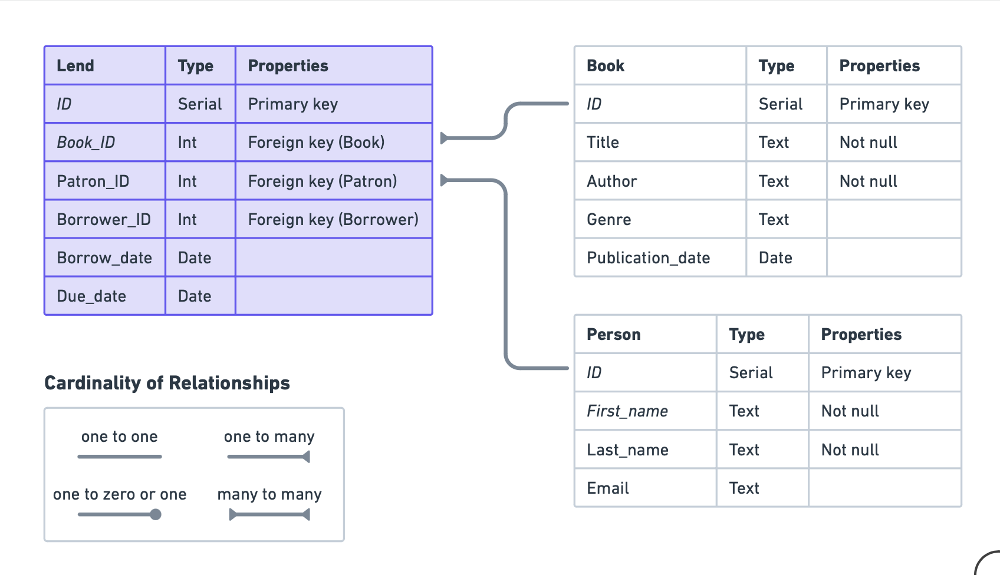
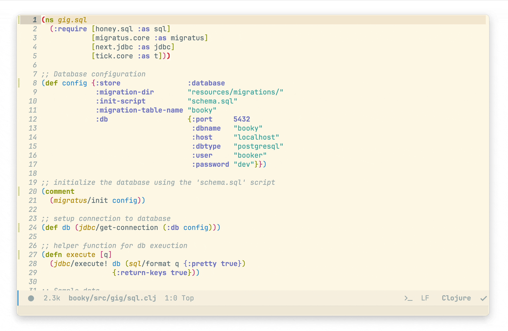
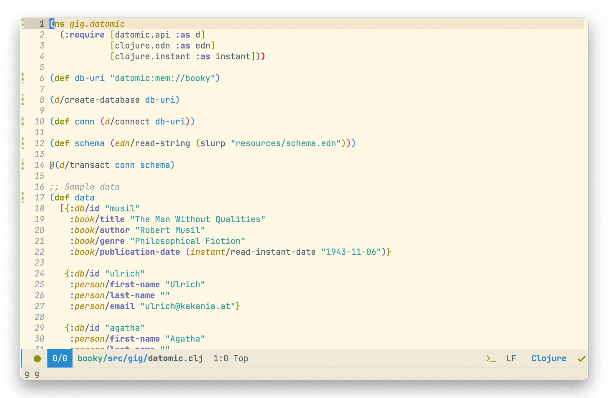

# Side by side: Datomic and PostgreSQL, Part 1

Greetings fellow Cojurians, to clarify from the outset, the objective of this article (or series of articles) is to highlight the differences in data modeling between SQL and Datomic. The conclusion will be yours to draw; I will merely present the facts.

Datomic was once considered a luxury product in the realm of parentheses, causing many companies and projects to avoid it. Eventually, NuBank decided to acquire Cognitect. Perhaps it was cheaper to buy the company than to continue paying licensing fees in the long term. A few months later, Datomic was released as a free-to-use product. 

What makes Datomic special? In my experience, it's an entirely different type of database compared to what I, and possibly you, have used in production before. It's a refreshing change in terms of developer experience and code organization. One particular feature that may seem alien to those in the SQL world is Datomic's time-oriented design. 

What does it mean to be time-oriented? In Datomic, the database does not only contain the current state of the data, but it also retains a complete history of changes made to that data. In other words, Datomic stores not only the present state but also past states of the data. However, before we delve into this, we will take a thorough tour of Datomic and SQL, comparing these two paradigms.

While there's much to discuss, I prefer to demonstrate through examples. The context will be simple data modeling and execution to provide examples of both approaches, enabling readers to draw their own conclusions.
— 
## ERD
To kick off our exploration, let’s define a simple _E_ntity _R_elationship _M_odel:


The path ahead of us is straightforward; it's a diagram illustrating ERD in an SQL database. Our SQL choice is the well-known Postgres. Within the Clojure ecosystem, we have a number of libraries that deal with SQL, such as HugSQL, HoneySQL, and plain SQL migration scripts. When dealing with database migration, my personal preference is the combination of plain `SQL` and `migratus`, a pair endorsed by our dear friend, exceptional individual, and veteran of Clojure open-source software - Sean Corfield, the author of our beloved HoneySQL.

## Schema 
### SQL
```sql
CREATE TABLE Book (
    id SERIAL PRIMARY KEY,
    Title TEXT NOT NULL,
    Author TEXT NOT NULL,
    Genre TEXT,
    Publication_Date DATE
);
--;;
CREATE TABLE Person (
    id SERIAL PRIMARY KEY,
    First_Name TEXT NOT NULL,
    Last_Name TEXT NOT NULL,
    Email TEXT
);
--;;
CREATE TABLE Registry (
    id SERIAL PRIMARY KEY,
    Book_ID INT,
    Patron_ID INT,
    Borrower_ID INT,
    Borrow_Date DATE,
    Due_Date DATE,
    FOREIGN KEY (Book_ID) REFERENCES Book(id),
    FOREIGN KEY (Patron_ID) REFERENCES Person(id),
    FOREIGN KEY (Borrower_ID) REFERENCES Person(id),
);
```
`--;;`  is `Migratus` specific comment to distinguish between SQL statements.
### Datomic
```clojure
;; Book
 {:db/ident       :book/title
  :db/valueType   :db.type/string
  :db/cardinality :db.cardinality/one
  :db/doc         "The title of a book."}

 {:db/ident       :book/author
  :db/valueType   :db.type/string
  :db/cardinality :db.cardinality/one
  :db/doc         "The author of a book."}

 {:db/ident       :book/genre
  :db/valueType   :db.type/string
  :db/cardinality :db.cardinality/one
  :db/doc         "The genre of a book."}

 {:db/ident       :book/publication-date
  :db/valueType   :db.type/instant
  :db/cardinality :db.cardinality/one
  :db/doc         "The publication date of a book."}

 ;; Person
 {:db/ident       :person/first-name
  :db/valueType   :db.type/string
  :db/cardinality :db.cardinality/one
  :db/doc         "The first name of a person."}

 {:db/ident       :person/last-name
  :db/valueType   :db.type/string
  :db/cardinality :db.cardinality/one
  :db/doc         "The last name of a person."}

 {:db/ident       :person/email
  :db/valueType   :db.type/string
  :db/cardinality :db.cardinality/one
  :db/doc         "The email of a person."}

 ;; Registry
 {:db/ident       :registry/book
  :db/valueType   :db.type/ref
  :db/cardinality :db.cardinality/one
  :db/doc         "The book being borrowed."}

 {:db/ident       :registry/patron
  :db/valueType   :db.type/ref
  :db/cardinality :db.cardinality/one
  :db/doc         "The patron lending a book."}

 {:db/ident       :registry/borrower
  :db/valueType   :db.type/ref
  :db/cardinality :db.cardinality/one
  :db/doc         "The borrower of a book."}

 {:db/ident       :registry/borrow-date
  :db/valueType   :db.type/instant
  :db/cardinality :db.cardinality/one
  :db/doc         "Borrowed date."}

 {:db/ident       :registry/due-date
  :db/valueType   :db.type/instant
  :db/cardinality :db.cardinality/one
  :db/doc         "The due date for returning the book."}]
```

- `:db/ident`: Unique identifier for an entity, which is typically used to provide a human-readable, namespace-qualified name for an entity, and once set, it cannot be changed. Namespace in our context is `:book` and `title` is its attribute.

- `:db/valueType`: The type of value that can be associated with an entity. For instance, it could be used to specify that an attribute must be of type `:db.type/string`, `:db.type/long`, `:db.type/boolean`, etc.
	-  `db.type/ref`  means it would refer to another entity, fact (_datum_)  
		Important different compared to SQL is a lack of direct connection with any specific entity. There’s no concept of foreign key in Datomic.

- `:db/cardinality`:  Is used to specify whether an attribute of an entity can have one or multiple values. If it is set to `:db.cardinality/one`, then each entity can have at most one value for the attribute. If it is set to `:db.cardinality/many`, then each entity can have many values for the attribute.

- `:db/doc`: Is used to store a human-readable documentation string for an entity. It's a good practice to provide documentation for all the entities and attributes in the database, to make it clear what they represent and how they should be used.

## Database setup and Migrations
Next step in line is to start the database and migrate schema 
### SQL
Create role and corresponding database (_I assume we have PostgreSQL running and console available_):
```sql
CREATE ROLE booker WITH LOGIN CREATEDB PASSWORD 'dev';
CREATE DATABASE booky WITH OWNER = booker;
```

#### Dependencies
Add these dependencies to `deps.edn` under `:deps` key
```clojure
;; migrations
migratus/migratus {:mvn/version "1.5.1"}
;; SQL DSL for Clojure
com.github.seancorfield/honeysql {:mvn/version "2.4.1045"}
;; PostgreSQL Driver
org.postgresql/postgresql {:mvn/version "42.6.0"}}
;; JDBC access layer
com.github.seancorfield/next.jdbc {:mvn/version "1.3.883"}}
```

####  Code 
`sql.clj`
```clojure
(ns gig.sql
  (:require [migratus.core :as migratus]))

;; Initialize database
(def config {:store                :database
             :migration-dir        "resources/migrations/"
             :init-script          "schema.sql"
             :migration-table-name "booky"
             :db {:port       5432
                  :dbname     "booky"
                  :host       "localhost"
                  :dbtype     "postgresql"
                  :user       "booker"
                  :password   "dev"}})

;initialize the database using the 'schema.sql' script
(migratus/init config)
```
1. import `migratus` library
2. Config
	- Create dir `resources/migrations` and sql file `init.sql` with SQL schema mentioned above
3. `init` function performs database initialization through provided configuration

### Datomic 
In this case things a little different as Datomic relies on other different types of storage for persistence. In our case, we’ll be using in memory for the demonstration purposes.[^1]
#### Dependency
```clojure
com.datomic/peer {:mvn/version "1.0.6735"}
```
#### Code
`datomic.clj`
```clojure
(ns gig.datomic
  (:require [datomic.api :as d]))

(def db-uri "datomic:mem://booky")

(d/create-database db-uri)

(def conn (d/connect db-uri))

(def schema (edn/read-string (slurp "resources/schema.edn")))

@(d/transact conn schema)
```
- To avoid polluting namespace, I’d rather keep schema into a separate file - `resources/schema.edn` 
- `d/transact` submits transaction to the database


## Save data into database 
### SQL
#### Sample data
```clojure
(def book
  {:title "The Man Without Qualities"
   :author "Robert Musil"
   :genre "Philosophical Fiction"
   :publication-date (t/date "1943-11-06")})

(def patron
  {:first-name "Ulrich"
   :last-name ""
   :email "ulrich@kakania.at"})

(def borrower
  {:first-name "Agatha"
   :last-name ""
   :email "agatha@kakania.at"})

(def registry
  {:book-id 1
   :patron-id 2
   :borrower-id 3
   :borrow-date (t/date "2023-07-28")
   :due-date (t/date "2023-10-28")})
```
#### Create a connection to database
```clojure
(def db (jdbc/get-connection (:db config)))
```
#### Save
```clojure
(jdbc/execute!
 db
 (sql/format
  {:insert-into :book
   :values [book]})
 {:return-keys true})
```
1. `jdbc/execut!` takes in datasource and query, performs execution and returns the result
2. `sql/format` is responsible for processing Clojure map into `SQL` query
3. The map is the example of HoneySQL map syntax
4. An option to return inserted data

The result
```clojure
[#:book{:id 14,
        :title "The Man Without Qualities",
        :author "Robert Musil",
        :genre "Philosophical Fiction",
        :publication_date #inst "1943-11-05T23:00:00.000-00:00"}]
```

#### `sql/format` and `honeysql`
The query above results in:
```clojure
["INSERT INTO book (title, author, genre, publication_date) VALUES (?, ?, ?, ?)"
 "The Man Without Qualities"
 "Robert Musil"
 "Philosophical Fiction"
 #time/date "1943-11-06"]
```

##### Perform the rest of insertions
At this point I’d rather compose a handy function for execution
```clojure
(defn execute [q]
  (jdbc/execute! db (sql/format q)
                  {:return-keys true}))
```
Hence insertion of remaining data is simplified
```clojure
(execute
 {:insert-into :person
  :values [patron
           borrower]})

(execute
 {:insert-into :registry
  :values [registry]})
```

### Datomic
#### Sample data
In case of Datomic, sample data looks a bit different, instead of separate definitions, we have all data in a single var:
```clojure
(def data
  [{:db/id "musil"
    :book/title "The Man Without Qualities"
    :book/author "Robert Musil"
    :book/genre "Philosophical Fiction"
    :book/publication-date (instant/read-instant-date "1943-11-06")}

   {:db/id "ulrich"
    :person/first-name "Ulrich"
    :person/last-name ""
    :person/email "ulrich@kakania.at"}

   {:db/id "agatha"
    :person/first-name "Agatha"
    :person/last-name ""
    :person/email "agatha@kakania.at"}

   {:registry/book "musil"
    :registry/patron "ulrich"
    :registry/borrower "agatha"
    :registry/borrow-date (instant/read-instant-date "2023-07-28")
    :registry/due-date (instant/read-instant-date "2023-10-28")}])
```
#### Save (transact)
```clojure
(d/transact conn data)
```

- `:db/id` is a temporary id used in the context of transaction to actually create a relationship. Example from the execution `{"musil" 17592186045418,   "ulrich" 17592186045419,  "agatha" 17592186045420}`
- _Hence we don’t explicitly force relationship on the schema level, but during transaction_. If we try to transact without `temporary id` the REPL will greet we with error - `:db.error/tempid-not-an-entity tempid 'whatever' used only as value in transaction`

## Querying data from database
I wouldn’t say that we’ve been sailing into much familiar waters until now, but at this point things do actually get quite different, challenging at some extent, but I do usually hold myself from jumping to conclusions till the moment I comprehend the technology and reasoning behind design decisions. Down the down you’ll see what I mean.

### Querying through (Honey)SQL
Run a simple query first, fetch all data from `person` table
```clojure
(execute
 {:select [:*]
  :from :person})
```
The result:
```clojure
[#:person{:id 1,
          :first_name "Ulrich",
          :last_name "",
          :email "ulrich@kakania.at"}
 #:person{:id 2,
          :first_name "Agatha",
          :last_name "",
          :email "agatha@kakania.at"}]
```

#### Borrower Agatha
Now, let’s make things a little complicated and fetch books from registry where the borrower is `Agatha`.[^2]
A regular SQL:
```sql
SELECT book.title, 
       registry.borrow_date,
       borrower.first_name AS borrower,
       patron.first_name AS patron
FROM registry
         INNER JOIN book ON registry.book_id = book.id
         INNER JOIN person AS borrower ON registry.borrower_id = borrower.id
         INNER JOIN person AS patron ON registry.patron_id = patron.id
WHERE borrower.email = 'agatha@kakania.at';
```
HoneySQL:
```clojure
(execute
 {:select [:book.title
           :registry.borrow-date
           [:borrower.first-name :borrower]
           [:patron.first-name :patron]]
  :from [:registry]
  :join [:book [:= :registry.book-id :book.id]
        [:person :borrower] [:= :registry.borrower-id :borrower.id]
        [:person :patron] [:= :registry.patron-id :patron.id]]
  :where [:= :borrower.email "agatha@kakania.at"]})
```
Result:
```clojure
[{:book/title = "The Man Without Qualities"
  :registry/borrow_date = 2023-07-28
  :person/borrower = "Agatha"
  :person/patron = "Ulrich"}]
```


### Querying through Datalog (Datomic)
Datalog is the querying language supported here, nonetheless Datomic provides 3 ways of pulling data:
1. `Pull API`: The pull API in Datomic is a powerful, declarative way to retrieve an entity and its associated attributes in one call, letting us shape the returned data to fit our needs.  

2. `Datalog Queries`: Datomic uses Datalog, a declarative logic programming language, enabling expressive relational queries including joins, recursion, negation, and more, where we specify a pattern to match in the database and get back a set of tuples matching the pattern.  

3. `Entity API`: The Entity API in Datomic is a simpler method to access the attributes of a single entity given its entity ID, offering a less flexible but straightforward alternative to the Pull API for accessing multiple attributes of a single entity.

#### A regular Datalog query
The first and utmost important step is to capture the current state of the database in Clojure, the usual step is:
```clojure
(def db (d/db conn))
```
The d/db function is used to get a value of the database from the connection. The value represents the entire database at a specific point in time.

Then we can perform queries:
```clojure
(d/q '[:find ?e ?first-name ?email
       :where
       [?e :person/first-name ?first-name]
       [?e :person/email ?email]]
     db)
```
- `q/q` is a query execution function
- `:find`  receives one or more attributes, SQL analog is `SELECT`
- `:where` is core of the query
	- `?e` is a variable that will hold the entity ID. In Datalog, variables are represented by symbols that start with a `?`
	- `:person/first-name` is an attribute in the database. In this case, it represents the first name of a person
	- `?first-name` is another variable that will hold the value of the `:person/first-name` attribute for the entity `?e` in the following queries if we need to narrow it down.

	The clause `[?e :person/first-name ?first-name] ` can be read as _for the entity `?e`, find the value of the `:person/first-name` attribute and bind it to the `?first-name` variable_.   
	  
	In more simple terms: _Find me the first name of a person, and let's refer to this person as `?e` and their first name as `?first-name`._

Result:
```clojure
#{[17592186045421 "Agatha" "" "agatha@kakania.at"]
  [17592186045420 "Ulrich" "" "ulrich@kakania.at"]}
```
A regular Datalog query returns _a set of tuples_ without corresponding keys. If we need to return maps, then `:keys` is require alongside corresponding arguments:
```clojure
(d/q '[:find ?e ?first-name ?last-name ?email
       :keys id first-name last-name email
       :where
       [?e :person/first-name ?first-name]
       [?e :person/last-name ?last-name]
       [?e :person/email ?email]]
     db)
```
Result
```clojure
[{:id 17592186045421,
  :first-name "Agatha",
  :last-name "",
  :email "agatha@kakania.at"}
 {:id 17592186045420,
  :first-name "Ulrich",
  :last-name "",
  :email "ulrich@kakania.at"}]
```

#### Pull API
```clojure
(d/q '[:find [(pull ?e [*]) ...]
       :where [?e :person/first-name]]
     db))
```
- `pull` is a function provided by Datomic that retrieves entities from the database along with their attributes.
- `?e` is a variable that represents an entity ID. This variable should have been bound to a value in a previous clause of the query.
- `[*]` is a pull pattern that specifies which attributes to retrieve. The asterisk (`*`) is a wildcard that means _all attributes_. `SQL` equivalent is SELECT *

So, `(pull ?e [*])` can be read as _retrieve the entity with the ID `?e` and all of its attributes_. 

In simple terms, it's like asking the database: _Give me everything you know about the entity identified by `?e`_.

Result:
```clojure
[{:db/id 17592186045420,
  :person/first-name "Ulrich",
  :person/last-name "",
  :person/email "ulrich@kakania.at"}
 {:db/id 17592186045421,
  :person/first-name "Agatha",
  :person/last-name "",
  :person/email "agatha@kakania.at"}]
```

#### Entity API
```clojure
(d/entity db entity-id)
```
- `d/entity` is a function provided by Datomic that retrieves an entity from the database. It returns an entity map, which is a lazy, dynamic view of the entity's attributes at the point in time represented by the database value.
- `db` _let’s repeat_ - `db` is the Datomic database value, representing a particular point in time in the database.
- `entity-id` is the unique identifier of the entity that we want to retrieve. This identifier is typically a number that Datomic automatically assigns when the `entity` is first created, but it can also be a `lookup ref` or a `tempid`, depending on the context.

 `(d/entity db entity-id)` can be read as _retrieve the entity with the ID `entity-id` from the database `db`_.

In simple terms - _Give me the thing (entity) identified by `entity-id`, as it was at the point in time represented by `db`_.

```clojure
(let [entity (d/entity db 17592186045420)]
  (select-keys entity [:person/first-name
                       :person/last-name
                       :person/email]))
```
Result:
```clojure
#:person{:first-name "Ulrich",
         :last-name "",
         :email "ulrich@kakania.at"}
```
In the context of the real-world application we usually hold the id and Entity API is certainly a unique and beneficial feature, particularly in the scenarios where the performance is critical.

#### Borrower - Agatha 
We had the first glance at Datomic query engine and it’s variations, at this point we’re ready to compose a bit more complex query and fetch registry record that corresponds `agatha` as the borrower.

```clojure
(d/q '[:find ?title ?borrow-date ?borrower-name ?patron-name
       :keys title borrow-date borrower patron
       :where
       [?registry :registry/book ?book]
       [?registry :registry/borrow-date ?borrow-date]
       [?registry :registry/borrower ?borrower]
       [?registry :registry/patron ?patron]
       [?book :book/title ?title]
       [?borrower :person/first-name ?borrower-name]
       [?borrower :person/email "agatha@kakania.at"]
       [?patron :person/first-name ?patron-name]]
     db)
```
1.  The first 4 clauses, regarding `:registry` identify an entry - the associated `book`, the `borrow date`, and both the `borrower` and `patron` involved
2. `[?book :book/title ?title]` retrieves the title of the associated book
3. `[?borrower :person/first-name ?borrower-name]` finds the first name of the borrower
4. `[?borrower :person/email "agatha@kakania.at"]` ensures that the borrower's email is `agatha@kakania.at`
5. `[?patron :person/first-name ?patron-name]`: Retrieves the first name of the patron

`:find` is complemented with a list of data variables we are interested in.

Result:
```clojure
[{:title "The Man Without Qualities",
  :borrow-date #inst "2023-07-28T00:00:00.000-00:00",
  :borrower "Agatha",
  :patron "Ulrich"}]
```



— 
At this in time and space, our little journey has come to an end. In the next article we’ll talk about Datomic Specific features, that would improve the processes we have talked about.

[^1]:	I know it’s not exactly the same, but I’d like to show that up and running Datomic in development mode is a simple as it possibly get.

[^2]:	Surely in a real-world scenario, where clause would be looked up by id, for the illustrative purposes, let’s use email.